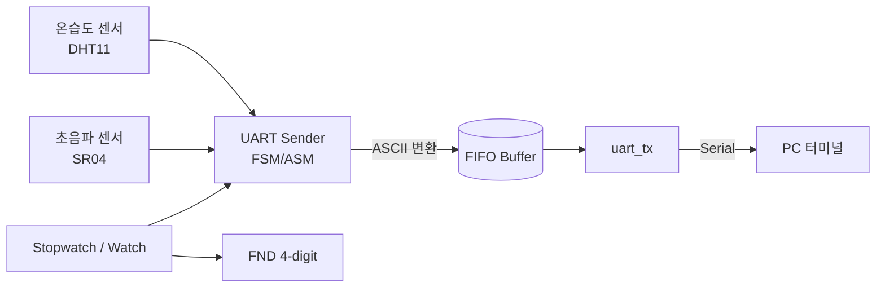
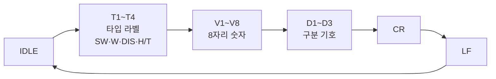

# UART Sensor Hub (FPGA) — Stopwatch · 초음파 · 온습도 데이터 PC 전송

> **UART Sender(ASCII·FIFO) 설계** — Stopwatch·초음파(SR04)·온습도(DHT11) 데이터를
> 사람이 읽을 수 있는 문자열로 변환해 PC로 전송하는 FPGA 프로젝트


다양한 타입의 데이터(Stopwatch·Watch·초음파 거리·온습도)를 **ASCII 문자열로 변환**하여
FIFO 버퍼를 거쳐 UART로 PC에 전송하는 시스템을 설계했습니다.
버튼 기반 Stopwatch·Watch는 FND로 출력하고, 센서 데이터는 PC 모니터에서 바로 읽을 수 있는 형식으로 표시합니다.

---

## Team & Role

> **팀 프로젝트** (신성민 · 송주연 · 조유정 · 최은수) · 기간: 2026.02 ~ 2026.02.23

**담당 (최은수)** — 다양한 타입의 데이터를 ASCII로 변환해 PC로 전송하는 **UART Sender 설계·구현**

---

## Highlights

- **UART Sender FSM/ASM 설계** — 타입 라벨·값·구분자·개행을 순서대로 출력하는 송신 FSM
- **ASCII 포맷팅** — 8자리 숫자를 자리별 ASCII로 변환, `CR/LF`로 줄바꿈까지 구현
- **FIFO 연동** — 변환된 바이트를 FIFO에 적재 후 `uart_tx`로 순차 전송
- **멀티 소스 통합** — Stopwatch·Watch(FND) + 초음파(SR04) + 온습도(DHT11)
- **보드 실증** — Basys3 FPGA에서 PC 시리얼로 문자열 정상 수신 확인

---

## System Block Diagram



---

## UART Sender FSM

타입 라벨 → 8자리 값 → 구분 기호 → 개행 순서로 바이트를 송신합니다.



> IDLE에서 `!i_send_start_prev` 조건으로 불필요한 case 루프 반복을 막고, **1회만** 송신 시퀀스를 시작

---

## 출력 포맷 예시

| 입력 | 출력 (PC 수신 문자열) |
|------|----------------------|
| `data = 12345678`, `i_type = 0` | `SW :12:34:56:78\r\n` |

`i_type`에 따라 라벨(SW·W·DIS·H/T)과 구분 기호를 선택하고, 8자리 값을 자리별 ASCII로 변환한 뒤
`CR/LF`로 줄바꿈하여 PC 터미널에서 바로 읽을 수 있는 문자열로 출력합니다.

---

## Features

| 기능 | 설명 | 출력 |
|------|------|------|
| **Stopwatch / Watch** | 버튼 기반 스톱워치·시계 | FND 4-digit |
| **초음파 (SR04)** | 거리 측정 데이터 | PC 문자열 (`DIS`) |
| **온습도 (DHT11)** | 온도·습도 데이터 | PC 문자열 (`H/T`) |

---

## Verification

- **송신 파형 검증** — `data=12345678`, `i_type=0` 입력 시 `"SW :12:34:56:78\r\n"` 출력 확인
- **opcode 동작** — `r`(`8'h72`) 입력 시 opcode `8'b0000_0001` 정상 동작 확인

---

## Troubleshooting

**1회 송신 보장 (rising edge 감지)**
> `i_send_start`의 0→1 rising edge에서만 1회 동작하도록 `i_send_start_prev` 신호 추가

**FIFO 무한 전송 방지**
> `busy_next` 미초기화로 FIFO pop이 차단되어 `uart_tx`가 무한 전송되는 문제
> → `busy_next`를 초기화하여 해결

**입력 타이밍 정렬**
> `clk`과 `i_send_start`가 동시에 rising하여 값을 인식 못하는 문제
> → 입력 타이밍을 정렬해 안정적으로 감지

---

## Demo & 발표자료

[](docs/Team Project1.mp4)

📄 [발표자료 (PDF)](docs/Team Project1.pdf)


## Project Structure

```
uart-sensor-fpga/
├── rtl/        # UART sender(FSM/ASM), FIFO, uart_tx, stopwatch, SR04·DHT11 컨트롤러
├── cons/       # FPGA 제약 파일 (Basys3 핀 배치 .xdc)
├── sim/        # 시뮬레이션 스크립트
├── docs/       # 발표 자료, 블록 다이어그램
└── README.md
```

---

## Tech Stack

`Verilog HDL` · `FSM / ASM 설계` · `UART (송수신)` · `FIFO Buffer` · `SR04 · DHT11 Sensor` · `Vivado` · `Basys3 FPGA`

---

<div align="center">

**최은수** · [@eunsu1209](https://github.com/eunsu1209)
_팀 프로젝트 · UART Sender 설계 담당_

</div>
